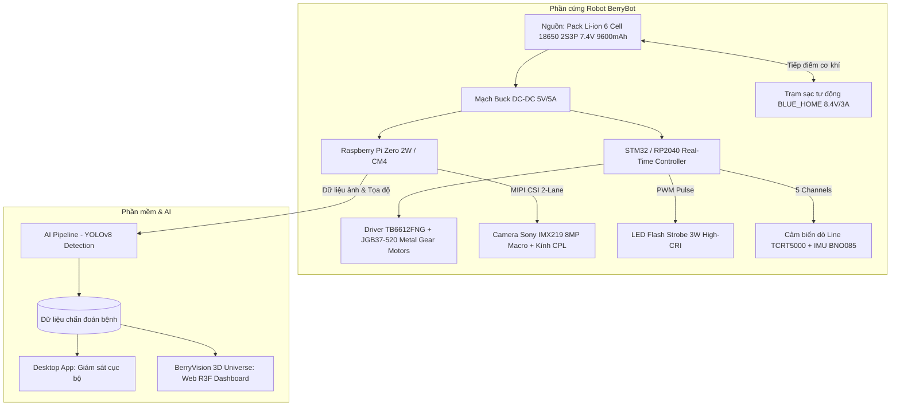

# 🍓 BerryVision AI — Smart Greenhouse Monitoring Robot & Vision Pipeline

> **Đề tài Nghiên cứu Khoa học (NCKH):** Ứng dụng công nghệ thị giác máy tính và xe tự hành bám line không gian trong theo dõi sức khỏe của cây trồng (Dâu tây / Dưa lưới) trong nhà kính công nghệ cao.

[](https://python.org)
[](https://ultralytics.com)
[](https://cyberbotics.com)
[-61DAFB?style=flat&logo=react&logoColor=black)](https://react.dev)
[](#)

---

## 📌 Giới Thiệu Đề Tài

Trong canh tác nông nghiệp công nghệ cao, việc giám sát từng cá thể cây thường gặp trở ngại lớn:
1. **Lắp đặt hàng loạt camera góc rộng cố định:** Tốn kém chi phí đầu tư hạ tầng, đi dây phức tạp và góc nhìn từ trên cao không thể soi rõ các ổ bệnh nấm, đốm lá ở mặt dưới tán.
2. **Kiểm tra thủ công:** Tốn nhân lực, dễ bỏ sót giai đoạn ủ bệnh ban đầu.

**BerryVision** đề xuất giải pháp đột phá:
* **01 Robot tự hành bám line cơ động (BerryBot):** Di chuyển tuần tra theo lưới tọa độ $(X, Y)$ chuẩn hóa trong nhà kính, giảm tới 80% chi phí so với hệ thống camera cố định.
* **Cơ chế chụp cận cảnh (Macro-imaging) kết hợp kính phân cực CPL & LED Strobe:** Triệt tiêu hiện tượng lóa nước và tán xạ ánh sáng mặt trời, chụp rõ từng đốm nấm phấn trắng hoặc rỉ sắt nhỏ dưới 0.5 mm.
* **AI YOLOv8 & Giao diện giám sát số hóa Web 3D:** Tự động phát hiện, định vị chính xác ô cây bị bệnh, giúp nông dân phun thuốc cục bộ, tiết kiệm 70% lượng hóa chất bảo vệ thực vật.

---

## 🏛️ Kiến Trúc Hệ Thống



---

## 📂 Cấu Trúc Mã Nguồn (Repository Structure)

```text
├── ai_pipeline/               # Pipeline huấn luyện, dự đoán & xử lý mô hình AI
├── controllers/               # Mã điều khiển robot bám line trong môi trường Webots
├── worlds/                    # Không gian mô phỏng nhà kính 3D (.wbt)
├── protos/                    # Định nghĩa các mô hình robot và đối tượng 3D
├── web_app/                   # Backend & API server quản trị
├── berryvision_3d_web/        # Dashboard giám sát không gian 3D tương tác (React + Three.js)
├── berryvision_v2_react/      # Ứng dụng Web Dashboard phiên bản React V2
├── desktop_app.py             # Ứng dụng Desktop điều khiển và theo dõi cục bộ
├── hardware_design_bom.md     # Bản vẽ thiết kế phần cứng & Danh mục linh kiện (BOM)
├── Chay_App_BerryVisionAI.bat # Script khởi động ứng dụng Desktop nhanh
├── Chay_Web_3D_BerryVision.bat# Script khởi động Web 3D Dashboard nhanh
└── README.md                  # Tài liệu giới thiệu đề tài
```

---

## ⚡ Hướng Dẫn Cài Đặt & Chạy Thử Nghiệm

### 1. Yêu Cầu Môi Trường
* **Hệ điều hành:** Windows 10/11 hoặc Ubuntu 20.04/22.04 LTS
* **Python:** 3.9+ trở lên
* **Node.js:** v18.0+ và npm
* **Cyberbotics Webots:** Phiên bản R2023b hoặc mới hơn

### 2. Chạy Ứng Dụng Desktop (BerryVision AI)
1. Cài đặt các thư viện phụ thuộc:
   ```bash
   pip install opencv-python ultralytics PyQt5 pillow
   ```
2. Chạy trực tiếp qua file script hoặc terminal:
   ```bash
   python desktop_app.py
   # hoặc nhấp đúp vào Chay_App_BerryVisionAI.bat
   ```

### 3. Chạy Web 3D Spatial Universe (React + Three.js)
1. Di chuyển vào thư mục Web 3D và cài đặt node packages:
   ```bash
   cd berryvision_3d_web
   npm install
   ```
2. Khởi chạy máy chủ phát triển cục bộ:
   ```bash
   npm run dev
   ```
3. Truy cập vào trình duyệt: `http://localhost:5173`

### 4. Khởi Động Mô Phỏng Webots
* Mở phần mềm **Cyberbotics Webots**.
* Chọn `File` -> `Open World...` -> mở file `worlds/NCKH_v2.wbt`.
* Nhấn nút **Play** trên thanh công cụ để xem xe tự hành dò line tuần tra nhà kính và kích hoạt camera Macro.

---

## 📊 Mô Hình Trí Tuệ Nhân Tạo (AI Pipeline)

* **Kiến trúc:** YOLOv8 (nano / small) tối ưu hóa chạy suy luận thời gian thực trên vi xử lý biên.
* **Các lớp bệnh phát hiện chính:**
  * Bệnh phấn trắng (*Powdery Mildew*)
  * Bệnh đốm mắt chim / đốm rỉ sắt lá (*Leaf Spot / Rust*)
  * Trạng thái sâu bọ / rệp hại dâu tây
  * Trái chín / Trái non đạt độ sinh trưởng
* **Trọng số mô hình (Weights):** Các file weights huấn luyện sẵn (`best.onnx`, `yolov8s.pt`) có thể được tải từ mục **Releases** hoặc liên kết lưu trữ đám mây của dự án.

---

## 🛠️ Thiết Kế Phần Cứng & Dự Toán Linh Kiện (BOM)

Chi tiết danh mục linh kiện, mạch điều khiển, thông số động cơ và trạm sạc tự động `BLUE_HOME` được mô tả đầy đủ tại:
👉 Xem chi tiết tại [hardware_design_bom.md](hardware_design_bom.md).

---

## 👥 Tác Giả & Bản Quyền

* **Đề tài:** Nghiên cứu Khoa học Sinh viên / Cán bộ nghiên cứu
* **GitHub Repository:** [https://github.com/nhtien2410-commits/Tie](https://github.com/nhtien2410-commits/Tie)
* Mọi đóng góp và phản hồi học thuật xin gửi về mục **Issues** hoặc **Pull Requests** của dự án.
