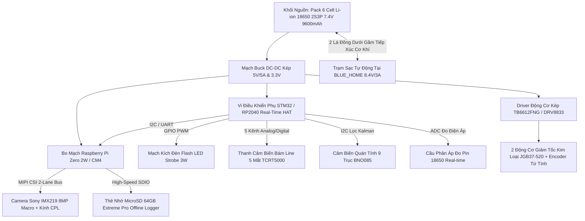

# 🍓 BẢN THIẾT KẾ PHẦN CỨNG & DỰ TOÁN KINH PHÍ HỆ THỐNG ROBOT BÁN CHUYÊN NGHIỆP (BERRYBOT SEMI-PRO)

**Cấu hình đã chọn:** **Lựa chọn 3: Bán Chuyên Nghiệp (Raspberry Pi Zero 2W / CM4 + Camera Sony IMX219 8.0MP + Động cơ Encoder Kim Loại JGB37 + Trạm Sạc Tự Động)**  
**Ngân sách phần cứng:** **~10.500.000 VNĐ**  
**Đặc tính:** Khung gầm nhôm 1515 tối giản nhỏ gọn (~15cm), chụp ảnh cận cảnh 8MP siêu nét qua giao tiếp MIPI CSI, ghi dữ liệu Offline thẻ nhớ, động cơ bánh răng thép tôi siêu bền và **tự động quay về Trạm sạc cơ khí tại mốc `BLUE_HOME`**.

---

## 1. SƠ ĐỒ KHỐI KIẾN TRÚC HỆ THỐNG

---

## 2. NÂNG CẤP VƯỢT TRỘI CỦA CẤU HÌNH BÁN CHUYÊN NGHIỆP (10.5 TRIỆU VNĐ)

1. **Bộ vi xử lý Raspberry Pi Zero 2W (Quad-Core 64-bit):**
   - Chạy hệ điều hành Linux nhúng ổn định, giao tiếp camera qua **chuẩn MIPI CSI 2-lane phần cứng** cho phép chụp và nén ảnh $8.0\text{ MP}$ ($3280 \times 2464\text{ px}$) trong thời gian $< 50\text{ms}$ mà không bị nghẽn bus dữ liệu.
2. **Cảm biến ảnh cao cấp Sony IMX219 (8.08 Megapixel):**
   - Ống kính quang học tinh chỉnh cự ly Macro ($10 - 15\text{ cm}$), độ phân giải cao gấp 4 lần camera thường, soi rõ từng sợi tơ nấm phấn trắng và đốm rỉ sắt nhỏ dưới $0.5\text{ mm}$ trên bề mặt lá dâu tây.
3. **Động cơ giảm tốc kim loại JGB37-520 & Encoder từ tính:**
   - Toàn bộ bánh răng bằng thép tôi nhiệt độ cao chống mài mòn, mô-men xoắn khỏe gấp 5 lần động cơ GA12-N20, tích hợp đĩa encoder từ tính $334\text{ xung/vòng}$ giúp đo chính xác quãng đường di chuyển tới từng milimet.
4. **Khối Pin Dung Lượng Khủng: 6 Cell Panasonic 18650 (2S3P 7.4V 9600mAh):**
   - Vận hành liên tục **8 – 10 tiếng** cho mỗi lần sạc đầy, hoàn thành nhiều vòng quét liên tục trong nhà kính lớn mà không lo gián đoạn.
5. **Trạm sạc tự động cơ khí tại `BLUE_HOME`:**
   - Khi pin $< 6.6\text{V}$, robot lưu trạng thái vào Flash, bám line về trạm sạc `BLUE_HOME`. Hai lá đồng tiếp xúc mạ vàng dưới gầm khớp vào trạm sạc $8.4\text{V}/3\text{A}$, sạc đầy tự động quay lại đúng ô tiếp tục nhiệm vụ.

---

## 3. BẢNG DỰ TOÁN KINH PHÍ CHI TIẾT (BOM - BILL OF MATERIALS)

| STT | Danh Mục Linh Kiện | Thông Số Kỹ Thuật Chi Tiết | Số Lượng | Đơn Giá (VNĐ) | Thành Tiền (VNĐ) |
| :---: | :--- | :--- | :---: | :---: | :---: |
| **I** | **HỆ THỐNG XỬ LÝ & THỊ GIÁC QUANG HỌC** | | | | **3.650.000** |
| 1 | Bo mạch Raspberry Pi Zero 2W | Quad-core 64-bit 1GHz, 512MB RAM, Wi-Fi/BT, CSI Camera port | 1 chiếc | 650.000 | 650.000 |
| 2 | Bo mạch mở rộng STM32/RP2040 HAT | Bo mạch vi điều khiển thời gian thực phụ trách điều khiển động cơ & ADC | 1 chiếc | 350.000 | 350.000 |
| 3 | Camera Module Sony IMX219 8MP Macro | Cảm biến Sony 8.08MP ($3280\times 2464$) kèm cáp FPC MIPI CSI góc rộng Macro | 1 bộ | 680.000 | 680.000 |
| 4 | Kính lọc phân cực CPL quang học | Kính lọc CPL tráng phủ Nano đa lớp chống trầy, khử triệt để lóa nước | 1 chiếc | 350.000 | 350.000 |
| 5 | Module LED Flash Strobe 3W + Kích xung | LED COB High-CRI 3W ánh sáng trắng 6000K kèm mạch Trigger MOSFET | 1 bộ | 120.000 | 120.000 |
| 6 | Thẻ nhớ MicroSD 64GB Extreme Pro | Thẻ nhớ Sandisk Extreme Pro U3/V30 tốc độ đọc ghi 170MB/s | 1 chiếc | 250.000 | 250.000 |
| 7 | Cảm biến IMU 9 trục BNO085 | Cảm biến góc xoay 9 trục cao cấp tích hợp thuật toán lọc Kalman bù trôi | 1 chiếc | 450.000 | 450.000 |
| 8 | Thanh cảm biến bám line 5 mắt TCRT5000 | Mạch dò line 5 kênh hồng ngoại chống nhiễu quang học | 1 bộ | 100.000 | 100.000 |
| 9 | Mạch đo áp pin ADC & Mạch Buck 5V 5A | Cầu phân áp trở chính xác $100\text{k}/47\text{k}$ + Mạch hạ áp Buck DC-DC 5A | 1 bộ | 150.000 | 150.000 |
| 10 | 2 Tiếp điểm sạc cơ khí mạ vàng | Cặp lá đồng tiếp xúc mạ vàng đàn hồi gắn dưới gầm xe | 1 cặp | 50.000 | 50.000 |
| **II** | **CƠ KHÍ, ĐỘNG LỰC & KHỐI NGUỒN** | | | | **3.850.000** |
| 11 | Khung nhôm định hình 1515 CNC | Bộ khung nhôm 1515 mạ Anodize bạc, ke góc đúc, ốc T-nut mạ niken | 1 bộ | 450.000 | 450.000 |
| 12 | Tấm đế Mica trong suốt cắt Laser CNC | Tấm Acrylic đúc chịu lực 3mm định vị toàn bộ bo mạch và khay pin | 1 bộ | 150.000 | 150.000 |
| 13 | Động cơ giảm tốc kim loại JGB37-520 | Động cơ bánh răng thép tôi 6V-12V 200RPM kèm đĩa Encoder từ tính | 2 chiếc | 380.000 | 760.000 |
| 14 | Driver động cơ kép TB6612FNG / DRV8833 | Mạch cầu H MOSFET công suất cao, tỏa nhiệt thấp, kiểm soát PWM mượt | 1 chiếc | 90.000 | 90.000 |
| 15 | Bánh xe cao su gai địa hình + Bánh caster | 2 bánh xe cao su $\varnothing 43\text{mm}$ cốt lục giác + 1 bánh caster bi cầu inox | 1 bộ | 120.000 | 120.000 |
| 16 | Khối Pin 6 Cell 18650 Panasonic 9600mAh | 6 cell pin Panasonic NCR18650B 3400mAh (2S3P) + Mạch Smart BMS 2S 20A | 1 bộ | 680.000 | 680.000 |
| 17 | Phụ kiện lắp ráp & Dây cáp chống nhiễu | Dây cắm bọc giáp, công tắc nguồn chịu dòng cao, cọc đồng định vị | 1 gói | 150.000 | 150.000 |
| **III**| **TRẠM SẠC TỰ ĐỘNG TẠI BLUE_HOME & HẠ TẦNG** | | | | **1.450.000** |
| 18 | Khung trạm sạc Docking Station nhôm | Bệ đế trạm sạc cố định bằng nhôm 1515 đặt tại mốc `BLUE_HOME` | 1 bộ | 250.000 | 250.000 |
| 19 | Cụm chân sạc Pogo Pin lò xo chịu dòng 5A | Chân sạc cơ khí lò xo mạ vàng tiếp xúc đàn hồi tin cậy | 1 bộ | 150.000 | 150.000 |
| 20 | Mạch sạc cân bằng 2S CC/CV tự ngắt | Module quản lý nạp sạc tự ngắt thông minh khi pin đạt $8.4\text{V}$ | 1 chiếc | 150.000 | 150.000 |
| 21 | Nguồn Adapter trạm sạc $12\text{V} / 3\text{A}$ | Nguồn chuyển đổi $220\text{V} \to 12\text{V}/3\text{A}$ cấp điện cho trạm | 1 chiếc | 180.000 | 180.000 |
| 22 | Băng dán line nhà kính & Decal mốc ô | Cuộn băng dán sàn công nghiệp 3cm + Decal màu đỏ/xanh chuẩn ô lưới | 1 gói | 120.000 | 120.000 |
| **IV** | **DỰ PHÒNG & GIA CÔNG HOÀN THIỆN ĐỀ TÀI** | | | | **1.550.000** |
| 23 | Chi phí gia công CNC / In 3D đồ gá | Gia công cơ khí chính xác các bệ đỡ camera và pát động cơ | 1 gói | 550.000 | 550.000 |
| 24 | Quỹ dự phòng linh kiện thay thế | Linh kiện dự phòng (pin, cảm biến, bánh xe thay thế thực nghiệm) | 1 gói | 1.000.000 | 1.000.000 |
| --- | **TỔNG KINH PHÍ HOÀN THIỆN CẢ HỆ THỐNG** | **GỒM 01 ROBOT BERRYBOT SEMI-PRO + 01 TRẠM SẠC TỰ ĐỘNG BLUE_HOME** | --- | --- | **10.500.000 VNĐ** |
